# Pratikum Pemrograman Web
## Aplikasi yang digunakan
1. Sublime text 3
2. Google chrome

## Langkah-langkah pratikum
### 1. Membuat paragraf
saya akan membuat 2 paragraf dengan beberapa kalimat,
memasukan kata di dalam ("body") dan menggunakan tag "p" di dalamnya.

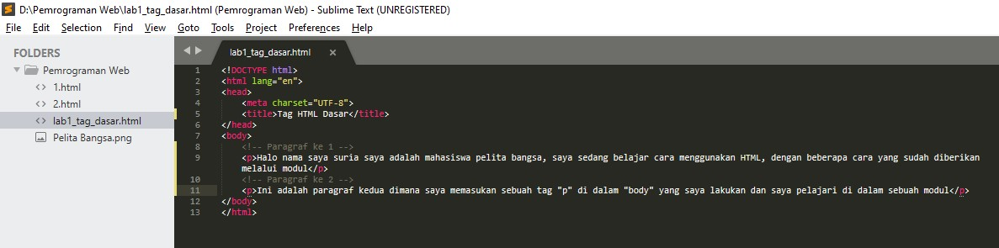

dan bukalah file lab1_tag_dasar.html ke google chrome lihat hasilnya.

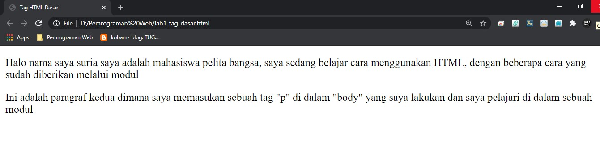

### 2. Memindahkan posisi paragraf
saya menggunakan "align" = justify, left, right, and center untuk memindahkan posisi kiri, kanan, tengah, dan rata kiri kanan.

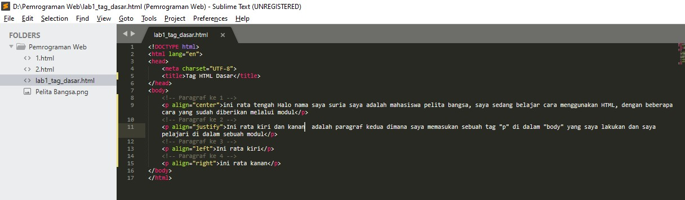

jika sudah refresh google chromenya lihat apa yang berubah.

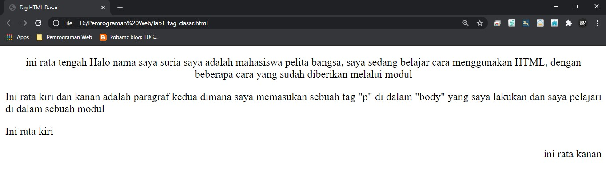

### 3. Menambahkan judul
tag judul memiliki 6 tingkatan h1 sampai h6, h1 yang terbesar hingga ke terkecil, saya akan memberikan judul di paragraf 1 dan 2.

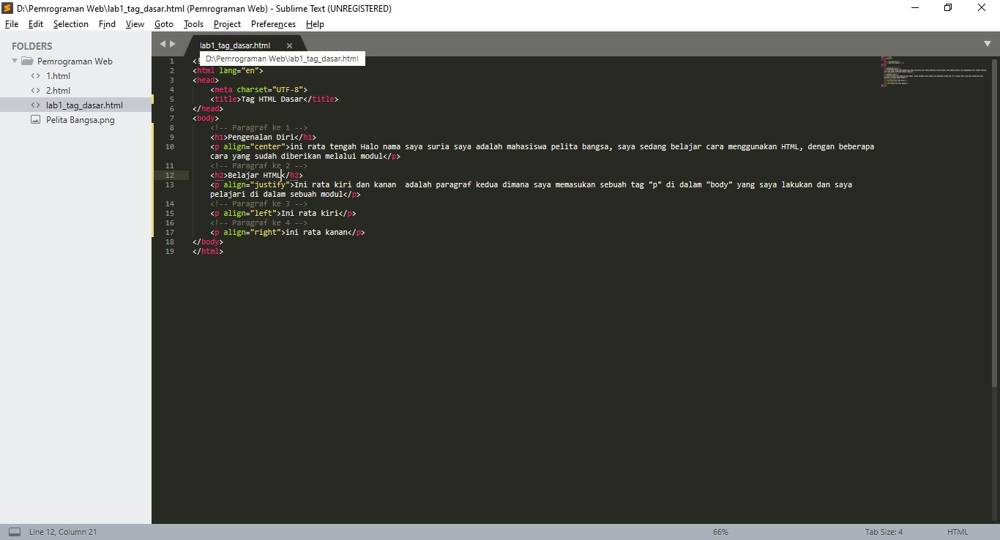

jika sudah refresh google chromenya lihat apa yang berubah.

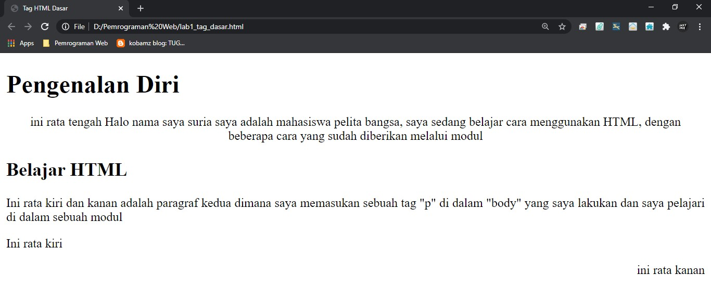

## 4. Memformat text dan paragraf
disini saya akan memformat text dan paragraf dengan 
br = Break line, hr = Horizontal line, pre = Preformat and b = Bold text, strong = Important text, i = Italic text, em = Emphasized text, mark = Marked text, small= Smaller text, del = Deleted text, ins = Inserted text, sub = Subscript text, sup = Superscript text. 

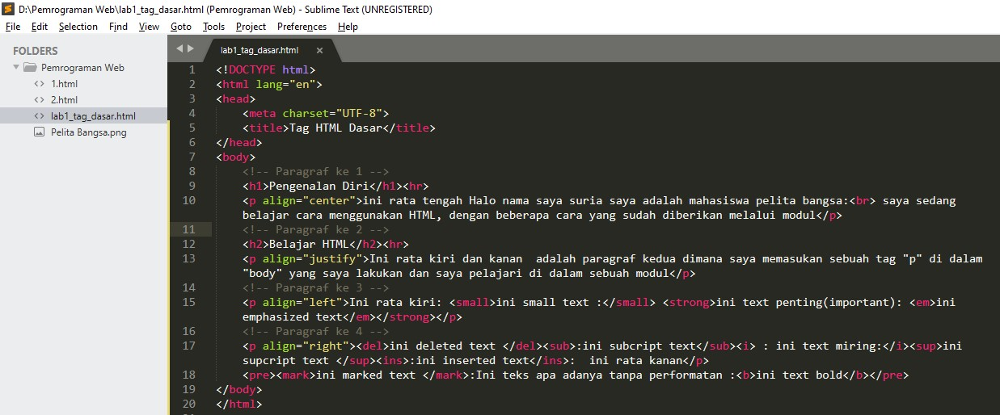

jika sudah refresh google chromenya lihat apa yang berubah.

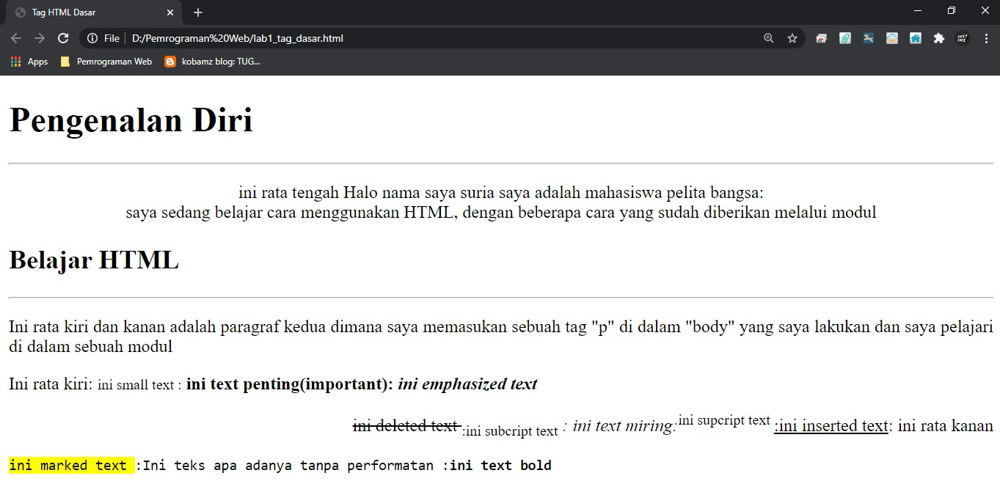

## 5. Menyisipkan gambar dan ukuran 
disini saya akan menyisipkan gambar dan menentukan ukuran logo universitas pelita bangsa kedalam 1 folder bersama dengan file htmlnya dan saya memasukan tag img untuk memasukan gambarnya dan perintah "width, height" untuk memasukan ukuran gambarnya kedalam paragraf di judul ke 3.

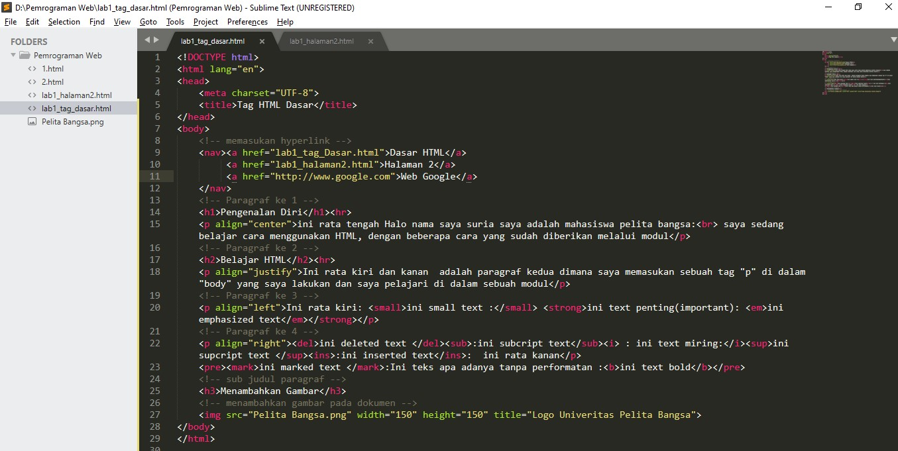

jika sudah refresh google chromenya lihat apa yang berubah.

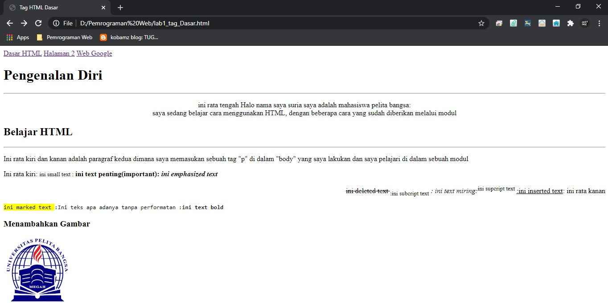

## 6. Menambahkan Hyperlink
saya akan menambahkan hyperlink di atas sebelum heading.
di situ saya memasukan di dalam "nav" tag "a" link lab1_tag_dasar.html, link halaman ke 2 yaitu lab1_halaman2.html dan link web eksternal link http://www.google.com.

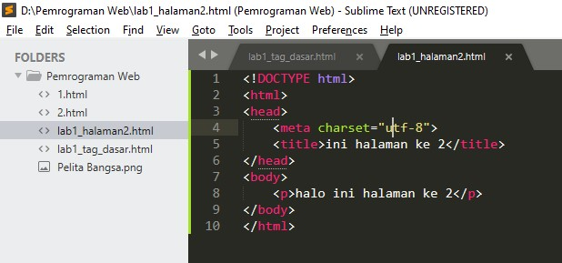

jika sudah refresh google chromenya lihat apa yang berubah.

jika di klik dasar HTML akan ke file lab1_tag_dasar.html, jika di klik halaman 2 akan ke lab1_halaman2.html, jika di klik web goole akan ke web googlenya.

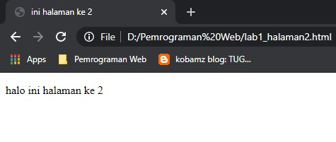

## 7. Pertanyaan
Jawab Pertanyaan Berikut 
1. Lakukan perubahan pada kode sesuai dengan keinginan anda, amati perubahannya adakah error ketika terjadi kesalahan penulisan tag? 
2. Apa perbedaan dari tag "p" dengan tag "br", berikan penjelasannya! 
3. Apa perbedaan atribut title dan alt pada tag "img", berikan penjelasannya!  
4. Untuk mengatur ukuran gambar, digunakan atribut width dan height. Agar tampilan gambar proporsional sebaiknya kedua atribut tersebut diisi semua atau tidak? Berikan penjelasannya!  
5. Pada link tambahkan atribut target dengan nilai atribut bervariasi ( _blank, _self, _top, _parent ), apa yang terjadi pada masing-masing nilai antribut tersebut? 

### Jawaban.
1. ada 5 kesalahan pada saat di validasi.

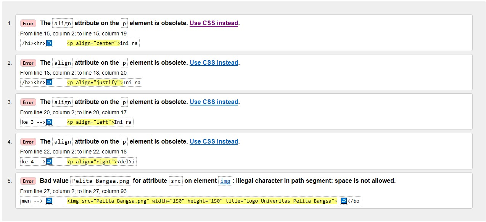

2.tag "p" hanya untuk memberikan paragraf dari sebuah kata dan tag "br" hanya break line, memindahkan sebuah kata ke baris selanjutnya.

3.Tittle adalah untuk memberikan judul pada gambar. Alt adalah text ini akan muncul di dalam wadah gambar ketika gambar tidak dapat di tampilkan.

4.agar proposional kedua atribut width dan height harus di isi, agar bisa mengatur keinginan ukuran pada gambarnya itu, kalau tidak di isi akan muncul secara default.

5._blank untuk membuka link di tab baru, _self untuk membuka link di frame link itu berada, _top untuk membuka link di frame paling atas (paling luar), _parent untuk membuka link di frame yang satu singkat di atas frame link tersebut berada.
